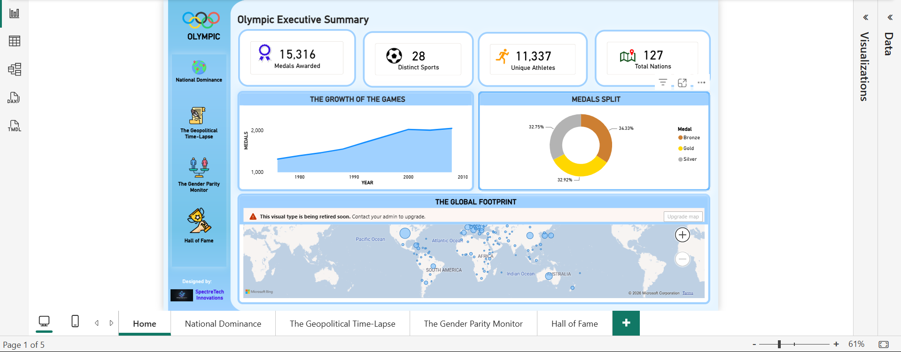

# Olympic-Summer-Games-Analysis-
Interactive Power BI dashboard analysing 15,316 Olympic medals (1976-2008) across 127 nations: national dominance, Cold War geopolitics, gender parity and athlete performance.
# Olympic Games Analytics Dashboard (1976-2008)

An interactive Power BI dashboard that explores 32 years of Summer Olympic Games data: who dominates, how world politics shaped the medal tables, how female participation has grown, and who the greatest athletes are.

## At a Glance

| Medals Awarded | Distinct Sports | Unique Athletes | Total Nations |
|:---:|:---:|:---:|:---:|
| 15,316 | 28 | 11,337 | 127 |

## Report Pages

### 1. Home: Olympic Executive Summary
Headline figures, the growth of the Games over time, the gold/silver/bronze split, and a global map showing where medal-winning nations are located. Navigation buttons lead to the other four pages.

### 2. National Dominance: The Olympic Titan Tracker
Ranks the top 10 countries by total medals with a gold/silver/bronze breakdown, compares host-nation performance against their average, and tracks the medal trend of the three leading powers (United States, USSR/Russia, China). A year slicer lets you filter by Games edition.

### 3. The Geopolitical Time-Lapse
Shows how history shaped the medal table: the reciprocal boycotts of 1980 and 1984 between the Soviet Union and the United States, the effect of the fall of the Berlin Wall on East Germany, Germany and USSR/Russia, and the fragmentation of Yugoslavia into Croatia, Serbia and Slovenia.

### 4. The Gender Parity Monitor
Tracks equality from 1976 to 2008 with the rising share of female medals, the gap between men and women over time, gender balance by sport, and events by gender designation. Slicers filter by gender and sport.

### 5. Athlete Performance: The Hall of Fame
Highlights the top 10 most decorated athletes, the top 5 nations across all sports, and a detailed athlete record table. A sport selector filters every visual on the page.

## Tools and Techniques

- **Power BI Desktop** for data modelling, DAX measures and report design
- **Power Query** for data cleaning and transformation
- **DAX** for calculated measures such as total medals, female percentage
- **Interactive features:** slicers, cross-filtering, page navigation buttons and tooltips

